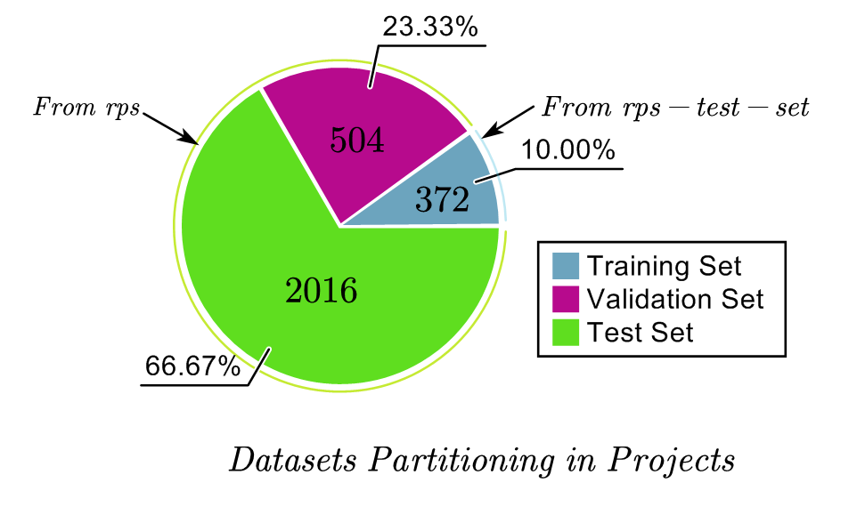
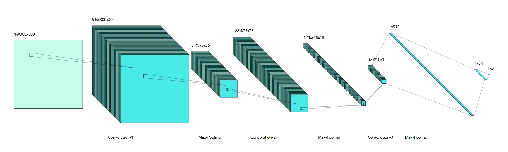

## AU3304-数字图像处理基础大作业-手势识别
#### Racheus Zhao
#### School of Machanic Engineering , SJTU
#### 2023-2024-1 Autumn
---
本大作业聚焦于剪刀石头布手势识别，要求参与的卷积层不超过3层，笔者的模型在测试集上训练的准确率可以达到*95.43%*。

数据集的组成为,其中rps-test-set中的数据全部用于检测。

调整参数后最优化的网络大概是这样：

调整优化卷积核的大小和池化层的大小，做数次实验可以得到下面的一些信息：

Different convolution kernel size:

Different Maxpooling kernel size:

具体的模型搭建和训练过程基于**Tensorflow**,细节参见[model9.ipynb](./model9.ipynb)

最后我尝试集成了一个用摄像头进行实时监测的Python脚本，细节参见[muGUI.py](./myGUI.py)

下面是一个使用效果的demo：

https://github.com/Racheus/DIP_Final_2023/assets/119780682/a09f9b51-7315-4347-83c5-b905728ad854

---

痛苦的一学期终于结束啦！感谢所有陪伴，我们江湖再见！

### 角声寒，夜阑珊，怕人询问，咽泪装欢。
